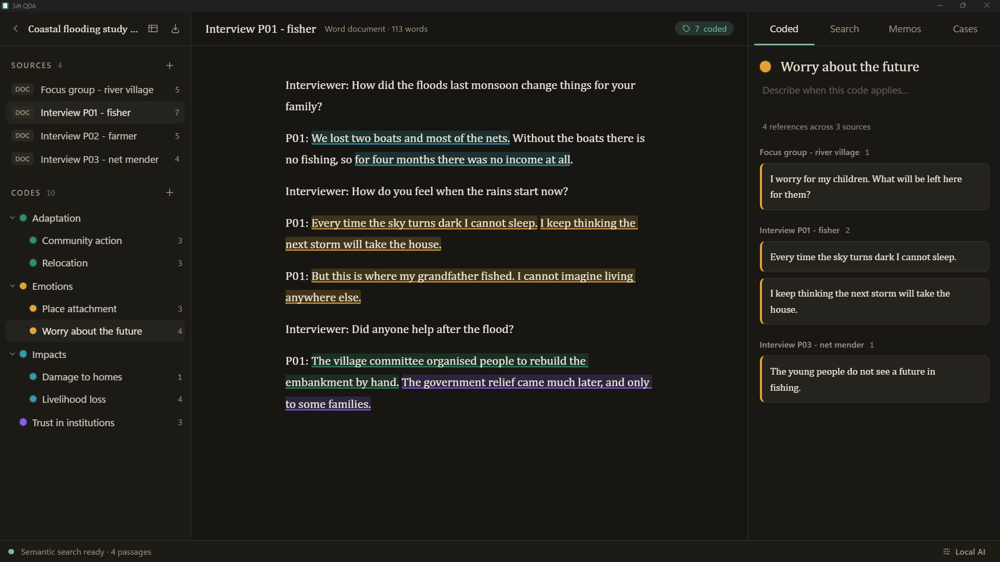
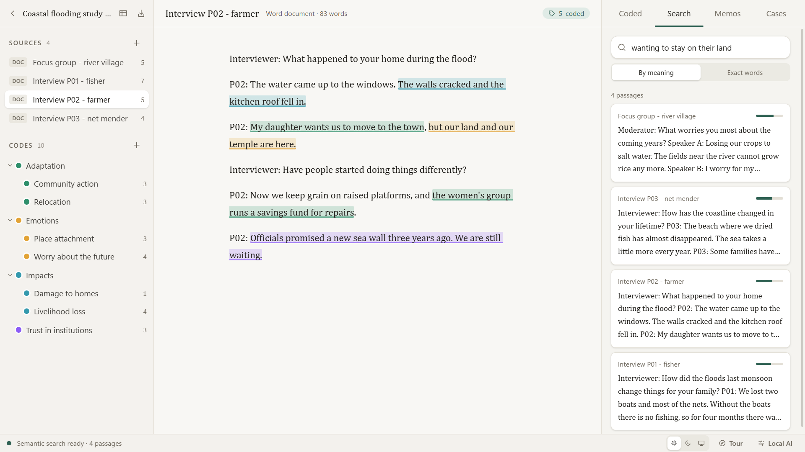
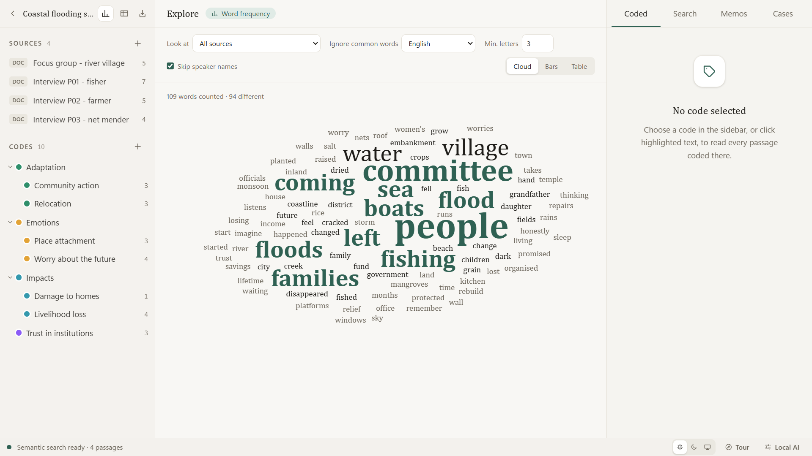
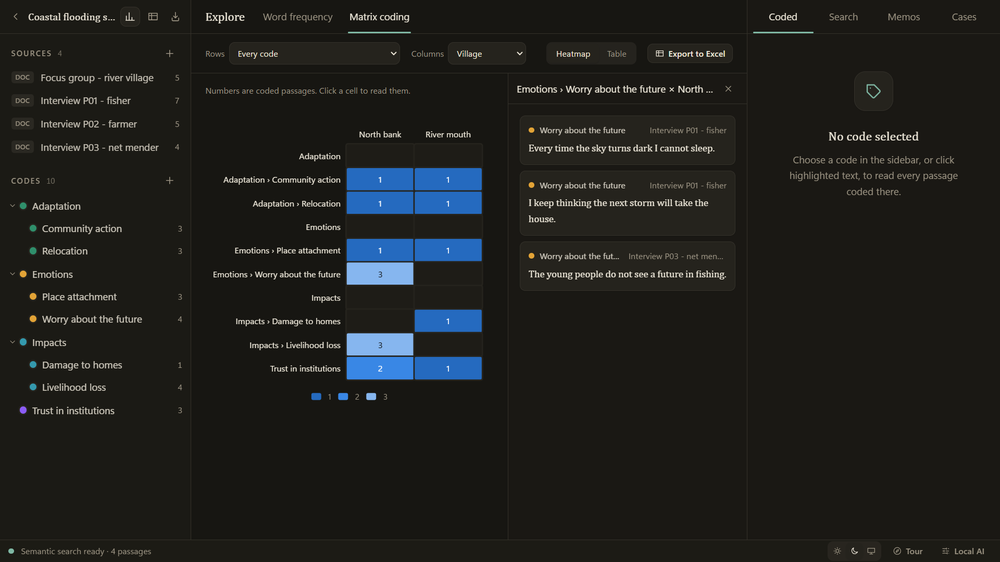

<div align="center">


# Sift QDA

**Free, open-source qualitative data analysis that stays on your computer.**

Code interviews, documents, PDFs and survey answers. Find passages by meaning, not just keywords.
Export your themes to Excel, or move the whole project to NVivo, ATLAS.ti or MAXQDA.

[](https://github.com/tarunv13/sift-qda/actions/workflows/ci.yml)
[](https://github.com/tarunv13/sift-qda/releases)
[](#license)


[Download](https://github.com/tarunv13/sift-qda/releases/latest) ·
[Who it's for](docs/use-cases.md) ·
[Getting started](#getting-started) ·
[How to cite](#how-to-cite) ·
[Contributing](CONTRIBUTING.md)

</div>

<p align="center">
  
  <br>
  <sub>Dark theme: coding a fictional interview from the demo study. All data shown is made up.</sub>
</p>

<p align="center">
  
  <br>
  <sub>Light theme: searching by meaning across the demo study. Switch between light, dark or match Windows from the status bar.</sub>
</p>

---

## Why Sift QDA

- **Your data never leaves the machine.** No account, no cloud sync, no telemetry. Transcripts
  that contain health, legal or personal details stay on your disk, which matters when an ethics
  board, a data-sharing agreement or a client contract rules out cloud tools. See
  [Protecting research data](SECURITY.md#protecting-research-data).
- **Free, with no catch.** No licence server, no student edition with a project cap, no
  subscription that locks your old projects when it lapses.
- **No lock-in.** Projects import and export as REFI-QDA (`.qdpx`), the exchange standard that
  NVivo, ATLAS.ti and MAXQDA also read and write.
- **Search by meaning, offline.** Ask for "fear of losing income" and find the participant who
  said "I didn't know how we'd pay rent". Embeddings are computed on your own computer by
  [Ollama](https://ollama.com).
- **Works the way many people already do.** One click exports every coded extract, the codebook,
  a code-by-document matrix and your memos to an Excel workbook.

|  | Sift QDA | Commercial CAQDAS (NVivo, ATLAS.ti, MAXQDA) |
| --- | --- | --- |
| Cost | Free | Paid licence or subscription |
| Source code | Open (MIT OR Apache-2.0) | Closed |
| Account or licence activation | None | Required |
| REFI-QDA project exchange | Yes | Yes |
| Semantic search | Local model, offline | Varies; AI features are often cloud-based |

Sift QDA is young. The commercial tools do much more (audio and video, visual models, team
servers). If you need the core of thematic analysis without the cost or the cloud, start here.

## Who it's for

Anyone who has to turn a pile of text into themes they can defend.

| Field | Typical material |
| --- | --- |
| Academic research | Interview and focus-group transcripts, field notes, theses using thematic analysis or grounded theory |
| UX and product research | User interviews, usability-test notes, support tickets, app-store reviews |
| Market research | Open-ended survey answers with respondent attributes (age, region, segment) |
| Public policy and consultation | Consultation responses, committee submissions, stakeholder interviews |
| Health and social care | Patient and practitioner interviews where data must stay on-premises |
| Monitoring and evaluation | NGO programme reports, beneficiary interviews, donor evaluations |
| Journalism and investigations | Leaked or FOIA document sets, court filings, interview notes |
| Law and compliance | Policy documents, contract clauses, regulatory responses |
| Education | Student reflections, course evaluations, classroom observations |
| HR and organisational research | Exit interviews, engagement-survey comments, culture audits |
| History and humanities | Archival letters, oral histories, digitised PDFs |
| Literature reviews | Coding findings and methods across a folder of papers |

Worked workflows for each are in **[docs/use-cases.md](docs/use-cases.md)**.

## Features

| Area | What you get |
| --- | --- |
| Coding | Select text, pick or create a code from a floating menu. Overlapping codes stack. |
| Codebook | Hierarchical codes (themes and sub-codes), colours, descriptions, every reference per code. Drag to reorganise, merge codes, move a passage to another code, and undo coding steps with Ctrl+Z |
| Word documents | `.docx`, `.doc` and `.odt`, keeping headings, lists and table rows |
| PDFs | Text with page numbers kept for every coded passage, plus the rendered page alongside |
| Spreadsheets | `.xlsx`, `.xls`, `.ods`: row 1 becomes attributes, each row becomes a case |
| Plain text | `.txt` transcripts |
| Audio interviews | Transcribe `.wav`, `.mp3`, `.m4a`, `.flac` and other audio with a Whisper-style transcriber already on your computer (a folder with `transcribe.py` and its `.venv`): English, Hindi or Hinglish, with optional speaker labels. The transcript becomes a source, and the audio plays from any passage you select |
| Semantic search | Local `nomic-embed-text` embeddings with int8-quantised `sqlite-vec` search |
| Exact search | Phrase search that works with no model installed |
| Local AI assistant | Summarise a source, a code's passages or a case into a linked memo, and get sub-code suggestions you can add in one click. Runs a local chat model (`llama3.2:3b` by default) through Ollama; nothing leaves the computer |
| Word frequency | Word cloud, bar chart or table of the most frequent words in the whole project, one source or one code. Leaves out common English or Hindi words and speaker labels; click a word to read every occurrence in context |
| Matrix coding | Heatmap or table of how many passages each code, or each theme with its sub-codes, has in each source, case or attribute value. Click a cell to read its passages; export to Excel with totals |
| Coding queries | Passages coded at one code and also, or, but not, or near another; include sub-codes, filter by a case attribute, and save the results as a new code |
| Charts | The codebook as a treemap or sunburst sized by coded passages (click a code to read it), and one code across every source as bars, each with a table view |
| Annotations and links | Comment on any passage, and link passages to each other within or across sources ("see also"); the Notes tab lists both and opens them in place |
| Coding stripes | A named bar beside the text for every coded passage, side by side where codes overlap; click one to open its code |
| Memos and cases | Autosaving memos linked to a source, code or case. An editable case table: add cases and attributes, edit values in place, link cases to sources, or create a case per source |
| Excel export | Coded extracts, codebook, codes × documents, documents, memos |
| REFI-QDA | `.qdpx` import and export: codes, sources, codings, variables, cases, notes |
| Guided tour | A first-run walkthrough spotlights each part of the app and what it does; replay it from **Tour** |
| Themes | Light and dark, or match Windows, switchable from the status bar |

<p align="center">
  
  <br>
  <sub>Explore → word frequency on the fictional demo study. Click any word to read every occurrence in context.</sub>
</p>

<p align="center">
  
  <br>
  <sub>Explore → matrix coding: codes by a case attribute, with the passages behind a cell. Export any matrix to Excel.</sub>
</p>

## Getting started

1. **Install.** Download `Sift QDA_<version>_x64-setup.exe` from
   [Releases](https://github.com/tarunv13/sift-qda/releases/latest) and run it. No admin rights
   needed. The installers are not code-signed yet, so Windows SmartScreen may warn you: choose
   **More info → Run anyway**. An `.msi` is also provided for managed computers.
2. **Create a project** and **import** your transcripts, PDFs or spreadsheets.
3. **Code.** Select a passage, then type a new code name or pick an existing one.
4. **Review.** Click a code to see every passage coded with it, across all documents.
5. **Export** to Excel for your write-up, or to `.qdpx` to share with a colleague on another tool.

### Turn on semantic search (optional)

```powershell
winget install Ollama.Ollama
ollama pull nomic-embed-text
ollama pull llama3.2:3b     # optional: summaries and sub-code suggestions
```

Keep Ollama running. Sift QDA indexes imported documents in the background and shows progress in
the status bar. Everything else, including exact search, works without it.

### Coming from NVivo, ATLAS.ti or MAXQDA

Export your project as REFI-QDA (`.qdpx`) from the other tool, then choose **Open an NVivo / REFI-QDA export** on the start screen of
Sift QDA. Codes, text sources, codings, cases and memos come across. See
[Known limitations](#known-limitations) for what does not.

## Build from source

Requirements: Node.js 20+, Rust stable (MSVC), Visual Studio 2022 Build Tools with
"Desktop development with C++", and the WebView2 runtime (preinstalled on Windows 11).

```powershell
git clone https://github.com/tarunv13/sift-qda.git
cd sift-qda
npm install
npm run tauri dev      # run the app
npm run tauri build    # build the .exe and .msi installers
```

Tests:

```powershell
cd src-tauri
cargo test                                            # unit and integration tests
python ..\scripts\make_fixtures.py $env:TEMP\siftqda-fixtures
$env:SIFTQDA_FIXTURES = "$env:TEMP\siftqda-fixtures"
cargo test                                            # adds parser tests on real files
```

The fixture script needs `pip install python-docx openpyxl fpdf2`.

## How it works

```
src-tauri/src      Rust backend: all file parsing and all database access
  db/              SQLite schema, one module per table group
  import/          docx, odt, xlsx, pdf and text parsers
  ai/              chunking, Ollama client, sqlite-vec index, background worker
  refi/            REFI-QDA import and export
  excel/           Excel workbook export
  commands/        thin Tauri command wrappers
src                React 19 + TypeScript UI (no file or database libraries)
  lib/api.ts       typed wrappers around the Rust commands
  components/      editor, sidebar, panels, pdf viewer, workspace
```

- **Offsets.** Codings store Unicode code-point offsets into each source's text, the same unit
  REFI-QDA uses, so they survive export and import unchanged.
- **Storage.** One SQLite database at `%APPDATA%\org.siftqda.desktop\siftqda.db`. Vectors live in
  a separate table and can be rebuilt from the text at any time.
- **Small on purpose.** No source file over 200 lines, minimal npm dependencies, hand-written UI
  primitives. The installer is about 5 MB.

## Roadmap

Ideas, not promises. Upvote or discuss them in
[Issues](https://github.com/tarunv13/sift-qda/issues).

- [ ] macOS and Linux builds
- [x] Audio interviews with local transcription
- [ ] Coding regions of PDFs and images
- [ ] Code co-occurrence matrix and charts
- [ ] Inter-coder agreement (Cohen's kappa) for team projects
- [x] Code suggestions from a local language model
- [ ] Multilingual embedding models
- [ ] Signed installers

## Known limitations

- Scanned PDFs have no text layer. Run OCR before importing.
- REFI-QDA export writes every source as text; original PDFs and PDF-region codings from other
  tools are not carried over.
- Video and image sources are not supported. Audio needs a local transcriber folder (see Features).
- Windows only for now.

## How to cite

If Sift QDA helps your research, please cite it. A software citation lets readers and reviewers see
exactly which tool and version produced your analysis, supports transparent qualitative methods, and
keeps free, privacy-first research software visible and maintained.

Use the **Cite this repository** button on the repository page (it reads [CITATION.cff](CITATION.cff))
or copy one of these, replacing the version with the one you used:

**APA 7**

> Verma, T. K. (2026). *Sift QDA: Local-first qualitative data analysis* (Version 0.2.0) [Computer software]. https://github.com/tarunv13/sift-qda

**BibTeX**

```bibtex
@software{verma_sift_qda_2026,
  author  = {Verma, Tarun Kumar},
  title   = {Sift QDA: Local-first qualitative data analysis},
  year    = {2026},
  version = {0.2.0},
  url     = {https://github.com/tarunv13/sift-qda},
  license = {MIT OR Apache-2.0}
}
```

**In a methods section**, for example:

> Interview transcripts were coded thematically in Sift QDA version 0.2.0 (Verma, 2026), an
> open-source qualitative data analysis application that stores and processes all data locally.

Releases are being archived on [Zenodo](https://zenodo.org) so that each version has a permanent DOI.
Once the first archive is live, its DOI will appear here and in the citation file.

**Used Sift QDA in a paper, thesis, report or course?** Please
[open an issue](https://github.com/tarunv13/sift-qda/issues/new?title=Used%20in%3A%20) with the
reference. Knowing where the tool is used helps decide what to build next.

## Contributing

Bug reports, feature ideas and pull requests are welcome. Start with
[CONTRIBUTING.md](CONTRIBUTING.md). Please follow the [Code of Conduct](CODE_OF_CONDUCT.md), and
report security issues privately as described in [SECURITY.md](SECURITY.md).

If Sift QDA saves you a licence fee or a week of copying quotes into spreadsheets, a ⭐ helps other
researchers find it.

## License

Licensed under either of

- Apache License, Version 2.0 ([LICENSE-APACHE](LICENSE-APACHE))
- MIT license ([LICENSE-MIT](LICENSE-MIT))

at your option. Unless you explicitly state otherwise, any contribution you submit for inclusion
in this project shall be dual licensed as above, without any additional terms or conditions.

## Acknowledgements

Built on [Tauri](https://tauri.app), [React](https://react.dev), [TipTap](https://tiptap.dev),
[SQLite](https://sqlite.org), [sqlite-vec](https://github.com/asg017/sqlite-vec),
[Ollama](https://ollama.com), [calamine](https://github.com/tafia/calamine),
[pdf-extract](https://github.com/jrmuizel/pdf-extract), [react-pdf](https://github.com/wojtekmaj/react-pdf)
and the [REFI-QDA standard](https://www.qdasoftware.org).
