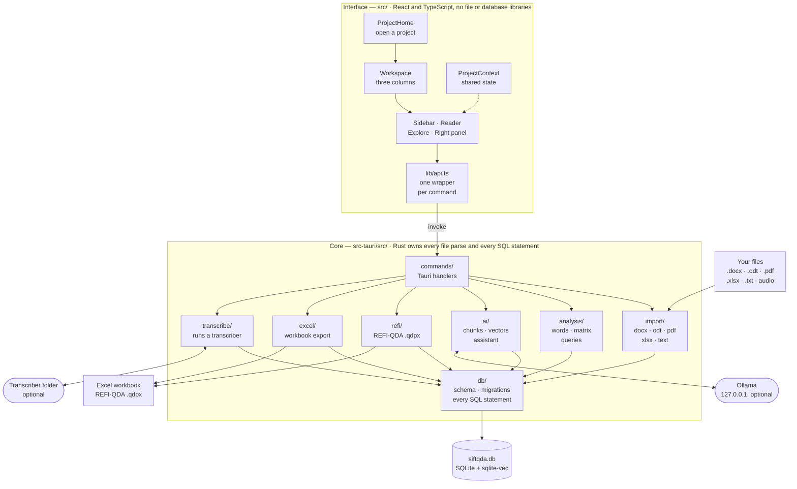
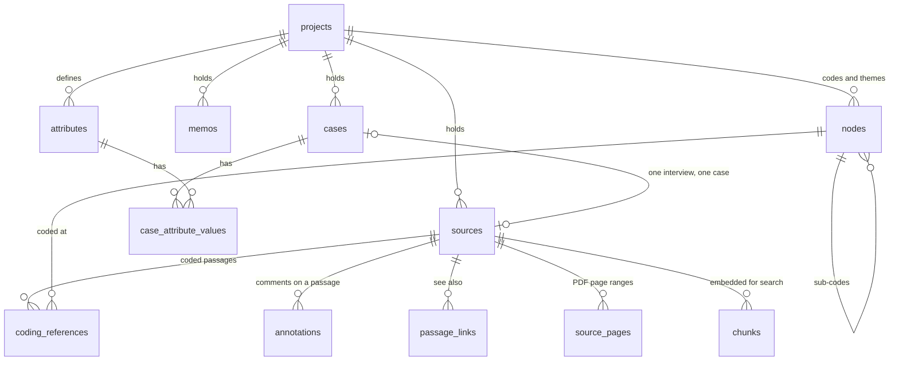

# How Sift QDA fits together

A map of the code: what each part does, where it lives, and how a sentence in an interview travels
from a file on your disk to a coded extract in an Excel workbook.

It is written for two kinds of reader: someone thinking about contributing, and someone — a
supervisor, an ethics reviewer, a data steward — who would rather check the "your data never leaves
the machine" claim against the code than take it on trust.

> **Prefer an interactive diagram?** Swap `hub` for `diagram` in this repository's address —
> [gitdiagram.com/tarunv13/sift-qda](https://gitdiagram.com/tarunv13/sift-qda) — and you get a
> generated, clickable map of the current code. GitHub's own Mermaid renderer cannot follow links
> from inside a diagram, so the table under the diagram here carries the links instead.

## The whole application

### Where each box lives

| Box | Path | What it does |
| --- | --- | --- |
| ProjectHome | [`src/components/projects/`](../src/components/projects) | Create, rename, open and delete projects; import a `.qdpx`. |
| Workspace | [`src/components/workspace/`](../src/components/workspace) | The three-column layout, the status bar and the AI settings. |
| Sidebar | [`src/components/sidebar/`](../src/components/sidebar) | The source list and the code tree, including drag-to-move. |
| Reader | [`src/components/editor/`](../src/components/editor), [`src/components/pdf/`](../src/components/pdf) | Read-only document with code marks, coding stripes and the audio bar; PDF pages. |
| Explore | [`src/components/explore/`](../src/components/explore) | Word frequency, matrix coding, coding query and charts, loaded on first use. |
| Right panel | [`src/components/panels/`](../src/components/panels) | References for the selected code, memos, annotations, see-also links, cases, search. |
| ProjectContext | [`src/state/ProjectContext.tsx`](../src/state/ProjectContext.tsx) | The one piece of shared state: open project, selection, notices. |
| lib/api.ts | [`src/lib/api.ts`](../src/lib/api.ts) | One typed wrapper per Rust command; the only place the interface calls the backend. |
| commands/ | [`src-tauri/src/commands/`](../src-tauri/src/commands) | Tauri handlers: lock the database, call a module, return serialisable data. |
| import/ | [`src-tauri/src/import/`](../src-tauri/src/import) | Parsers for `.docx`, `.odt`, `.pdf`, `.xlsx` and plain text, plus the source writer. |
| db/ | [`src-tauri/src/db/`](../src-tauri/src/db) | [`schema.sql`](../src-tauri/src/db/schema.sql), migrations, and one module per table group. |
| analysis/ | [`src-tauri/src/analysis/`](../src-tauri/src/analysis) | Word counts, keyword in context, the coding matrix and Boolean coding queries. |
| ai/ | [`src-tauri/src/ai/`](../src-tauri/src/ai) | Paragraph chunking, the Ollama client, the vector index, summaries and sub-code suggestions. |
| refi/ | [`src-tauri/src/refi/`](../src-tauri/src/refi) | REFI-QDA exchange: reads and writes `project.qde` inside a `.qdpx` zip. |
| excel/ | [`src-tauri/src/excel/`](../src-tauri/src/excel) | Coded extracts, codebook, matrix, documents and memos as one workbook. |
| transcribe/ | [`src-tauri/src/transcribe/`](../src-tauri/src/transcribe) | Runs the transcriber already installed on the computer and imports its Markdown. |
| Entry point | [`src-tauri/src/lib.rs`](../src-tauri/src/lib.rs) | Opens the database, starts the embedding worker, registers every command. |

## What the app talks to

Only three things outside its own process, and all of them are on your own computer.

1. **The database.** One SQLite file in the app's `AppData` folder, opened and migrated in
   [`db/mod.rs`](../src-tauri/src/db/mod.rs). Vectors live in a separate `sqlite-vec` table and can
   be rebuilt from the text at any time.
2. **Ollama**, if you turn on semantic search or the assistant. The address is a setting and
   defaults to `http://127.0.0.1:11434` ([`ai/config.rs`](../src-tauri/src/ai/config.rs)). The HTTP
   client is `ureq` with `default-features = false` ([`Cargo.toml`](../src-tauri/Cargo.toml)), so no
   TLS stack is compiled in and the binary cannot make an `https://` request at all.
3. **A transcriber folder**, if you transcribe audio: a folder on this computer holding
   `transcribe.py` and its `.venv`. Its path is kept in the local database only, never in this
   repository ([`transcribe/config.rs`](../src-tauri/src/transcribe/config.rs)).

No account, no sync, no telemetry, no crash reporting. See
[Protecting research data](../SECURITY.md#protecting-research-data).

## The data

Every table is created by [`db/schema.sql`](../src-tauri/src/db/schema.sql); columns added later come
from [`db/migrate.rs`](../src-tauri/src/db/migrate.rs).

Positions in `coding_references`, `annotations` and `passage_links` are **Unicode code-point
offsets** into `sources.content` — the unit REFI-QDA uses for `PlainTextSelection`, which is why
codings survive an export and re-import unchanged. The helpers are in
[`text.rs`](../src-tauri/src/text.rs) and [`src/lib/offsets.ts`](../src/lib/offsets.ts).

## Five journeys through the code

**Importing an interview.** A file chosen in the sidebar →
[`commands/sources.rs`](../src-tauri/src/commands/sources.rs) → the parser for its extension in
[`import/`](../src-tauri/src/import) → [`import/store.rs`](../src-tauri/src/import/store.rs) writes
one row in `sources`, plus page ranges for a PDF → the background worker queues its paragraphs for
embedding.

**Coding a passage.** Select text in the reader → `AttachCodeMenu` → `saveCodingReference` in
[`src/lib/api.ts`](../src/lib/api.ts) → [`commands/coding.rs`](../src-tauri/src/commands/coding.rs) →
a row in `coding_references` → the reader redraws the mark and the right panel refreshes.

**Searching by meaning.** [`ai/chunk.rs`](../src-tauri/src/ai/chunk.rs) splits sources on paragraph
boundaries, [`ai/worker.rs`](../src-tauri/src/ai/worker.rs) embeds them in the background through
Ollama, and [`ai/vectors.rs`](../src-tauri/src/ai/vectors.rs) stores them int8-quantised. A query is
embedded the same way and matched against that table in
[`commands/search.rs`](../src-tauri/src/commands/search.rs).

**Exploring patterns.** The Explore tabs call `word_frequency`, `coding_matrix` or `coding_query`
([`commands/analysis.rs`](../src-tauri/src/commands/analysis.rs),
[`commands/matrix.rs`](../src-tauri/src/commands/matrix.rs),
[`commands/query.rs`](../src-tauri/src/commands/query.rs)). Rust counts; the interface only draws,
through [`src/lib/charts.ts`](../src/lib/charts.ts), which registers just the ECharts pieces the app
uses.

**Leaving.** `export_excel` builds the workbook in [`excel/`](../src-tauri/src/excel), and
`export_qdpx` writes `project.qde` and a `sources/` folder into a zip in
[`refi/export.rs`](../src-tauri/src/refi/export.rs). Both read the database and write one file where
you choose; nothing is uploaded.

## Rules the code follows

- **Rust owns parsing and SQL.** The interface never opens a file or writes a query; it calls a
  command.
- **No source file over 200 lines.** Long modules are split rather than grown, which is why `db/`,
  `analysis/` and `components/` hold many small files.
- **Minimal npm dependencies**, relaxed only for charting and PDF rendering.
- **Never identify a code by colour alone**: every chart has a table beside it.
- **Tests sit next to the code they cover** in `src-tauri/src/`, and run on Windows in
  [CI](../.github/workflows/ci.yml).

## Keeping this map honest

Every path above is a real link, and
[`scripts/check-docs-links.mjs`](../scripts/check-docs-links.mjs) checks on each pull request that
the file or folder it points at still exists. If you add a module or move a folder, update the
diagram and the table in the same pull request: a wrong map is worse than no map.
